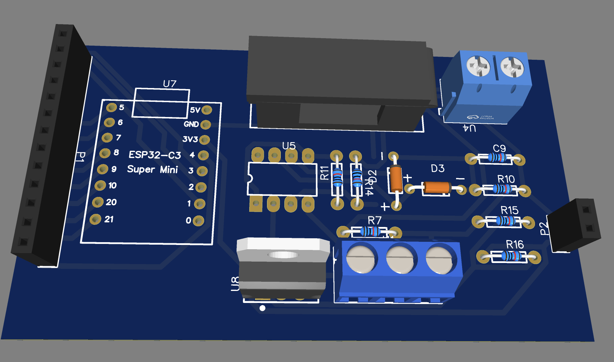
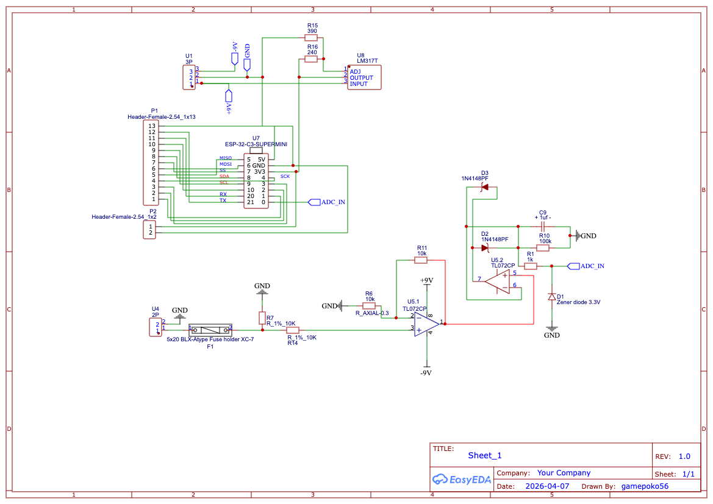
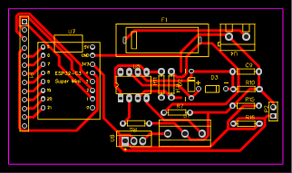

# ⚡ 33kV Leakage Current Monitor System




ระบบตรวจวัดกระแสไฟรั่ว (Leakage Current) ความแม่นยำสูงสำหรับระบบไฟฟ้าแรงสูง 33kV ออกแบบมาเพื่อการทำงานที่เสถียรในสภาพแวดล้อมที่มีสัญญาณรบกวน (Noise) สูง ผสมผสานการดัดแปลงทางฮาร์ดแวร์เพื่อแก้ปัญหาคลื่นความถี่ และการประมวลผลสัญญาณดิจิทัล (DSP) ขั้นสูง

---

## 🌟 Key Features

- **Clean OOP Architecture:** โครงสร้างโค้ดแบบ Object-Oriented Programming แยกโมดูลชัดเจน ง่ายต่อการพัฒนาต่อยอดและบำรุงรักษา
- **Multi-Stage DSP Pipeline:**
  - **Oversampling:** ดึงค่า 200 รอบต่อลูปเพื่อเพิ่มความละเอียดเสมือน (Virtual Resolution) 
  - **EMA Filter (Exponential Moving Average):** กรองสัญญาณความถี่สูงทิ้ง ทำให้ค่าแรงดัน (V) นิ่งสนิท
  - **Hysteresis UI Stabilizer:** ระบบแช่แข็งตัวเลขหน้าจอ ป้องกันตัวเลขกระพริบ (Flickering) ในระดับจิ๋วๆ
- **8-Point LUT Calibration:** แปลงค่าแรงดันเป็นกระแสไมโครแอมป์ (µA) ด้วยระบบเทียบบัญญัติไตรยางศ์ (Linear Interpolation) 8 ระดับ แก้ปัญหากราฟไม่เป็นเส้นตรง
- **Hardware-Tuned:** ปรับจูนอัตราขยายของวงจร Op-Amp เรียบร้อยแล้วเพื่อแก้ปัญหาสัญญาณขลิบ (Signal Clipping)

---

## 🧰 Hardware & Components

วงจรนี้ไม่ได้ใช้โมดูลสำเร็จรูป แต่เป็นการบิ้วท์วงจรขึ้นมาเองเพื่ออ่านค่า Analog ให้แม่นที่สุด อุปกรณ์หลักๆ มีดังนี้:

- **บอร์ดประมวลผลหลัก:** ESP32-C3 Super Mini (เล็ก แรง มี WiFi/Bluetooth ในตัว)
- **ไอซีขยายสัญญาณ (Op-Amp):** TL072CP (ทำหน้าที่ขยายสัญญาณ และเป็นวงจรแปลงกระแสสลับเป็นกระแสตรง)
- **วงจร Rectifier:** ไดโอด 1N4148 (แปลงคลื่น AC 50Hz ให้เป็นไฟ DC)
- **ระบบป้องกันบอร์ดพัง:** Zener Diode 3.3V + ตัวต้านทาน 1kΩ (ใส่คั่นก่อนเข้าขาบอร์ด ป้องกันไฟกระชากทะลุ 3.3V)
- **C/R ทั่วไป:** - Resistor 10kΩ (ที่ตำแหน่ง R11 ใช้ดรอปอัตราขยายลงมา)
  - Capacitor 1uF (ตัว C9 ขาดไม่ได้ ทำหน้าที่ Smoothing เกลี่ยคลื่นให้เรียบ)
- **วงจรจ่ายไฟ:** LM317T (สำหรับคุมไฟเลี้ยงวงจร)

### 📐 Schematic & PCB Layout
*รายละเอียดการเดินสายและลายวงจรที่ใช้ในโปรเจกต์:*

**Schematic Diagram:**


**PCB Routing:**


---

## ⚙️ How It Works

ระบบนี้แบ่งการทำงานเป็น 2 ฝั่ง คือ ฝั่งหน้าด่าน (Hardware) และ ฝั่งหลังบ้าน (Software) ทำงานประสานกันแบบนี้:

**1. ฝั่ง Hardware: รับและจัดทรงสัญญาณ**
- สัญญาณไฟรั่ว (50Hz) จากเสา 33kV วิ่งเข้ามาที่ไอซี TL072 
- วงจรถูกดัดแปลงพิเศษ (ถอด C8 ทิ้ง) เพื่อไม่ให้มันบล็อกคลื่น 50Hz และดรอปอัตราขยาย (Gain) ลงเหลือ 2 เท่า (เปลี่ยน R11 เป็น 10k) เพื่อป้องกันอาการรูปคลื่นบี้แบนหรือขลิบยอด (Clipping) เวลามีไฟรั่วเข้ามาแรงๆ
- จากนั้นวงจรจะแปลงคลื่นสลับให้กลายเป็นไฟ DC เรียบๆ และผ่านวาล์วนิรภัย (Zener 3.3V) ก่อนส่งเข้าขา ADC (Pin 1) ของ ESP32

**2. ฝั่ง Software: กรองขยะและแปลงค่า**
- **Oversampling:** บอร์ด ESP32 จะอ่านค่ารัวๆ ถึง 200 ครั้งในเสี้ยววินาที แล้วจับมาหาค่าเฉลี่ยเพื่อสยบ White Noise จากฮาร์ดแวร์
- **EMA Filter:** เอาค่าที่เฉลี่ยแล้ว โยนเข้าสมการ Low-pass Filter หน่วงค่าอีกรอบ เพื่อให้กราฟนิ่งสนิทเหมือนโช้คอัพรถ
- **LUT Conversion:** เอาค่าแรงดัน (โวลต์) ที่นิ่งกริ๊บแล้ว ไปเปิดตารางบัญญัติไตรยางศ์ (Lookup Table 8 จุด) เพื่อแปลงเป็นหน่วย ไมโครแอมป์ (µA) ให้ตรงกับเครื่องมือวัดมาตรฐาน
- **Hysteresis UI:** ก่อนจะปริ้นท์เลขออกจอ โค้ดจะเช็กก่อนว่าถ้ากระแสขยับแค่จิ๊ดเดียว (ไม่เกิน 3 µA) จะสั่งให้ตัวเลข "แช่แข็ง" ไว้ที่เดิม เพื่อไม่ให้เลขทศนิยมเต้นยิกๆ จนคนหน้างานตาลาย

---

## 🚀 Quick Start / Setup

1. เชื่อมต่อสายสัญญาณ `ADC_IN` เข้ากับ **Pin 1** ของ ESP32-C3 Super Mini
2. เปิดไฟล์ใน Arduino IDE และตั้งค่าบอร์ดเป็น ESP32-C3
3. ไปที่เมนู `Tools` และตั้งค่า **USB CDC On Boot: Enabled** (สำคัญมากสำหรับการดู Serial Monitor บนชิป C3)
4. กด Upload โค้ด
5. เปิด Serial Monitor ที่ Baud Rate `115200`

---

## 📐 Calibration Guide

หากมีการเปลี่ยนบอร์ด ESP32 หรือไอซี Op-Amp จะต้องทำการอัปเดตตาราง LUT ใหม่ โดยเข้าไปแก้ในคลาส `CalibratorLUT` ในซอร์สโค้ด:

```cpp
// [X] ค่าแรงดัน FilterV ที่บอร์ดอ่านได้ ณ ขณะนั้น
const float _rawVoltage[8] = { 0.0330f, 0.0746f, ... };

// [Y] ค่ากระแสไฟรั่วจริง (µA) ที่อ่านได้จากมิเตอร์มาตรฐาน
const float _target_uA[8]  = { 0.0f,    6.6f,   ... };
